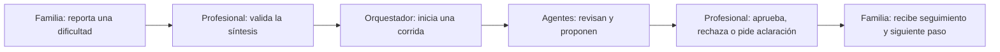

# Neuroalianza — Ruta Viva

**Ruta Viva coordina y da seguimiento a la atención de niños y adolescentes con trastornos del neurodesarrollo, para que familias y equipos de salud conozcan el siguiente paso y puedan actuar antes de que la ruta se interrumpa.**

Es un MVP demostrable para el desafío INSN. Trabaja con información sintética. No diagnostica, prescribe, confirma citas ni reemplaza la decisión de un profesional.

## Repositorio para desarrollo

La estructura separa las aplicaciones, el backend y la documentación técnica. El código activo está en `apps/` y `api/`.

```text
apps/platform       Plataforma profesional en React + Vite
apps/family-pwa     PWA para familias en React + Vite
api                 Backend FastAPI, reglas y agentes
docs                Arquitectura, guías, referencias y material del MVP
```

Para integrar código o cambiar la orquestación, empieza por:

- [Mapa del repositorio](docs/development/repository-map.md)
- [Agentes y orquestación](docs/architecture/agents.md)
- [Seguridad y límites del MVP](docs/safety.md)
- [Despliegue de la demostración pública](docs/development/despliegue.md)

## Qué muestra el MVP

Ruta Viva reúne dos productos conectados a la misma API y a una misma base de datos:

| Producto | Usuario | Para qué sirve |
| --- | --- | --- |
| `apps/family-pwa` | Familia o cuidador | Consultar el estado de la ruta, registrar dificultades, revisar documentos, conocer al equipo y pedir orientación. |
| `apps/platform` | Profesional de salud | Revisar casos, validar la información, observar la coordinación de agentes y decidir el siguiente paso. |
| `api` | Ambos productos | Conserva casos, eventos, decisiones y trazabilidad; aplica las reglas de seguridad y autorización. |

## Recorrido de una ruta



1. La familia inicia sesión en la PWA con DNI y contraseña, consulta la ruta y puede reportar una dificultad, por ejemplo falta de cupo o de horario compatible.
2. El profesional abre el caso y compara el aviso original con la síntesis asistida. Puede corregirla, pedir una aclaración o validarla.
3. Solo después de esa validación puede pulsar **Reproducir caso**. El orquestador ejecuta una corrida observable y guarda cada evento.
4. Los agentes generan resultados revisables. No cambian la ruta ni crean tareas por cuenta propia.
5. El profesional revisa la propuesta y registra la decisión. Si aprueba, se crea el siguiente paso y la PWA familiar se actualiza con el estado correspondiente.
6. La plataforma conserva el historial, los artefactos y el grafo de trazabilidad de la corrida.

## Orquestación supervisada

| Componente | Qué revisa o hace | Regla principal | Resultado visible |
| --- | --- | --- | --- |
| Orquestador de la ruta | Ordena la corrida, emite eventos y controla el estado. | Se detiene ante una decisión profesional; no autoriza ni modifica la ruta. | Estado de corrida, secuencia y trazabilidad. |
| Navegador de Ruta | El contexto autorizado, la etapa y la dificultad reportada. | Usa solo datos del caso autorizado. | Resumen de contexto y evidencia usada. |
| Coordinador de Atención | Alternativas administrativas o de coordinación. | Propone opciones; no confirma citas ni referencias. | Propuesta para revisión profesional. |
| Seguimiento Personalizado | El seguimiento y recontacto después de una decisión. | Solo se activa con un paso autorizado. | Mensaje y tarea de seguimiento. |
| Inteligencia y Calidad | La integridad de la corrida y señales agregadas. | No identifica familias ni hace conclusiones clínicas. | Controles de trazabilidad y datos agregados. |

La plataforma explica cada componente con tres preguntas: **qué está haciendo**, **qué evidencia utiliza** y **qué control requiere**. Los estados siempre combinan texto, icono y color. Con movimiento reducido, la ejecución se expresa mediante cambios de estado y texto, sin desplazamientos entre nodos.

## Modelo local y respuestas familiares

El MVP puede usar Ollama con `qwen3:8b` para la coordinación y para preguntas abiertas de la familia. La interfaz indica el modelo efectivo cuando responde el modelo local. En consultas clínicas, urgentes o fuera del alcance, el backend devuelve una respuesta de seguridad en lugar de pedir una respuesta al modelo.

Las reglas principales son:

- La IA organiza información y propone artefactos; no toma decisiones clínicas.
- Una tarea solo aparece después de una decisión profesional registrada.
- La API limita las consultas al modelo y registra el proveedor y modelo utilizados.
- Si Ollama no está disponible, el sistema usa una respuesta de respaldo claramente identificada.

## Ejecutar localmente

### Requisitos

- Node.js 20 o superior
- Python 3.11 a 3.13
- Ollama solo si se desea usar Qwen local

Clona el repositorio:

```bash
git clone https://github.com/miguel-isidro05/neuroalianza-ruta-viva-mvp.git
cd neuroalianza-ruta-viva-mvp
```

Crea el entorno de Python. En macOS o Linux:

```bash
python3 -m venv api/.venv && api/.venv/bin/pip install -r api/requirements.txt
```

En Windows:

```bash
python -m venv api/.venv
```

```bash
api\.venv\Scripts\pip install -r api\requirements.txt
```

Instala las dependencias de ambas aplicaciones:

```bash
npm --prefix apps/platform ci && npm --prefix apps/family-pwa ci
```

Los scripts de npm localizan el intérprete del entorno virtual en `api/.venv` de forma automática,
así que `npm run dev:api`, `npm test` y `npm run build` funcionan igual en Windows, macOS y Linux.

### 1. Modelo local opcional

Para usar Qwen:

```bash
ollama pull qwen3:8b
ollama serve
```

Si no se inicia Ollama, la plataforma conserva el flujo demostrable mediante el proveedor de respaldo. Para ejecutar solo el modo determinista:

```bash
export NEUROALIANZA_AGENT_PROVIDER=deterministic
```

### 2. API

```bash
npm run dev:api
```

### 3. Plataforma y PWA

En dos terminales distintas:

```bash
npm run dev:platform
```

```bash
npm run dev:family
```

| Servicio | Dirección |
| --- | --- |
| Plataforma profesional | `http://127.0.0.1:5173` |
| PWA para familias | `http://127.0.0.1:5174` |
| API y documentación | `http://127.0.0.1:8000/docs` |

Credenciales sintéticas:

| Rol | DNI | Contraseña |
| --- | --- | --- |
| Familiar | `12345678` | `familia123` |
| Profesional | `87654321` | `profesional123` |

## Guion breve para la demostración

1. Abre la PWA, inicia sesión como familiar y entra a **Inicio**. Muestra la ruta, el siguiente paso y el aviso de que la información es sintética.
2. En **Reportar dificultad**, registra una dificultad de horario, transporte o documentos. La familia puede consultar **Ayuda** para orientarse sobre estados confirmados.
3. Abre la plataforma como profesional. En **Casos y validación**, revisa el aviso original y valida la síntesis.
4. En **Orquestación**, abre el orquestador o cualquiera de los cuatro agentes. Pulsa **Reproducir caso** y observa el estado de la corrida, la evidencia y los resultados.
5. Cuando aparezca la compuerta humana, aprueba o devuelve la propuesta. Explica que ningún agente puede saltar ese control.
6. Abre **Historial y evidencia** para mostrar la cronología, los artefactos y el grafo que conectan la barrera, la corrida y la decisión.

## Validación local

```bash
npm test
npm run build
```

El proyecto está pensado para una sola instancia de Uvicorn: la cola y el canal de eventos del MVP viven en memoria.

## Integración futura

La política de autorización está en `api/app/orchestration/` y permanece separada de las aplicaciones. Esto permite conectar el frontend y backend del equipo sin mover el control humano fuera del orquestador.

La implementación toma como referencia el patrón operativo de Eigent/Multi-Agent-Orchestrator: corrida persistente, procesador de fondo, eventos, recuperación y control de pausa o reanudación. Para mantener el alcance del MVP, usa FastAPI, SQLite y Ollama local en lugar del conjunto completo de servicios de esos repositorios.

## Límites del MVP

- Todos los casos y documentos son sintéticos.
- No es una historia clínica ni un sistema de diagnóstico.
- No confirma citas, referencias, cupos o disponibilidad sin registro verificable.
- El uso real requiere validación institucional, seguridad, interoperabilidad, protección de datos y gobernanza clínica.

## Componentes abiertos y reutilizables

Cada pieza puede adoptarse por separado, sin arrastrar el resto del proyecto.

| Componente | Ruta | Qué resuelve para quien lo reutiliza |
| --- | --- | --- |
| Orquestación supervisada | `api/app/orchestration/manager.py` | Máquina de estados, cola, pausa, reanudación, recuperación y eventos persistidos, con la compuerta humana dentro del contrato y no como una convención opcional. |
| Adaptadores de proveedor de IA | `api/app/orchestration/providers.py` | Contrato de artefacto estructurado con adaptador para Ollama y proveedor determinista de respaldo. Permite demostrar un flujo con IA sin depender de que haya modelo disponible. |
| Reglas de autorización | `api/app/services.py`, `api/app/dependencies.py` | Lógica que condiciona la creación de tareas a una decisión profesional registrada. |
| Contratos de datos | `api/app/models.py`, `api/app/schemas.py` | Modelo de caso, barrera, decisión, tarea, evento y corrida para un proceso de continuidad asistencial. |
| PWA accesible | `apps/family-pwa/` | Objetivos táctiles de 44 px o más, estados que no dependen solo del color, soporte de `prefers-reduced-motion` y un service worker que excluye `/api/` y las peticiones autenticadas. |
| Grafo de procedencia | `apps/platform/src/ProvenanceGraph.tsx` | Visualización que conecta entrada, regla, herramienta, salida y decisión humana. |

Para adaptar la orquestación a otro dominio, empieza por `docs/architecture/agents.md`: la política
de autorización vive en `api/app/orchestration/` y está separada de las aplicaciones, de modo que se
puede cambiar el frontend sin mover el control humano fuera del orquestador.

## Licencia

Publicado bajo licencia [MIT](LICENSE). Puedes consultar, usar, adaptar y redistribuir estos
componentes reconociendo la autoría del equipo.

Los patrones de arquitectura de Eigent / Multi-Agent-Orchestrator se usaron como referencia
conceptual y fueron reimplementados; no son una dependencia de ejecución. Ver
`docs/research/manifest.md`.

## Entregables de la Hackatón

| Documento | Ruta |
| --- | --- |
| Anexo 1 — Formato de entrega final | [`docs/entrega/anexo-1-formato-entrega-final.md`](docs/entrega/anexo-1-formato-entrega-final.md) |
| Anexo 2 — Declaración de uso de IA generativa | [`docs/entrega/anexo-2-declaracion-ia-generativa.md`](docs/entrega/anexo-2-declaracion-ia-generativa.md) |
| Impacto en salud y viabilidad | [`docs/entrega/impacto-y-viabilidad.md`](docs/entrega/impacto-y-viabilidad.md) |
